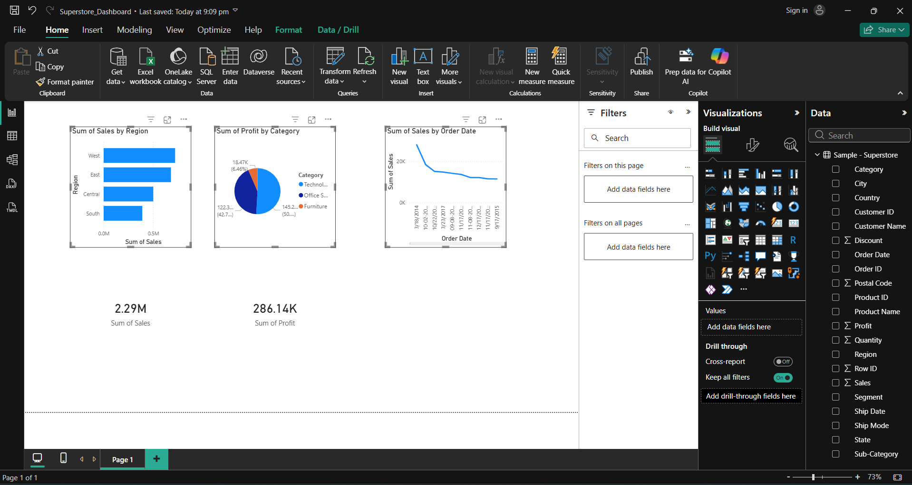

# Superstore Sales Dashboard

## Project Overview
Analysis of 9,994 retail orders to identify sales trends and profit insights.

## Tools Used
- Excel — Data cleaning and Pivot Tables
- Power BI — Interactive Dashboard

## Key Insights
- West region leads with $721K in sales (31% of total)
- Technology is most profitable category (50% of total profit)
- Furniture has lowest profit margin despite high sales
- Sales grew 66% from 2014 to 2017

## Dashboard Preview

